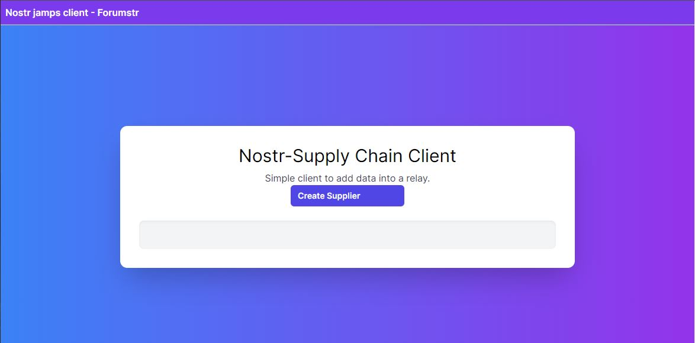
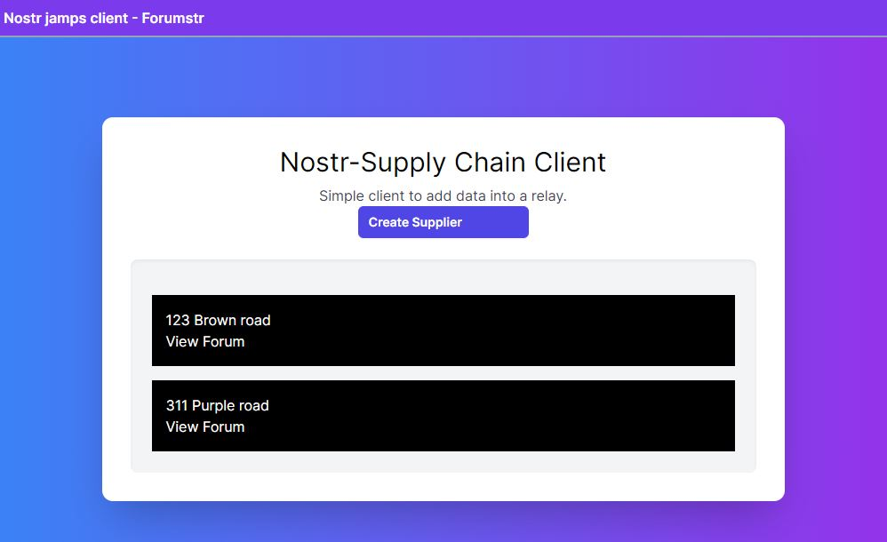

# Nostr-Jamps-V7

This is the Nsotr relay network project V7 with 3 relays (All dockerised) and a simple client (also Dockerised) interface for supply chain. This project currently contains 3 relays that have been chosen to parse data into relays in a supply chain environment. We have also included a simple client interface so you can input data into the relays and test the relays. 

## Before you start

This project requires the understanding of the nostr protocol, docker, websockets, port binding in docker and bash

Prerequisites you need to have installed in the machine 

- Docker 
- Bash
- WSL
- nodejs (reccomended for the client)
- npm (reccomended for the client)

## [NIPs](https://github.com/nostr-protocol/nips) that are supported by this relay network

- [x] NIP-01: Basic protocol for all supply chain needs
- [x] NIP-02: Contact list and petnames in identifying supply chain users.
- [x] NIP-04: Encrypted Direct messaging for supply chain customers and merchants
- [x] NIP-09: Event deletion
- [x] NIP-11: NIP-11, specifies a standard for relays to provide metadata to clients. This metadata helps clients understand the capabilities, limitations, and contact details of the relay. By following NIP-11, relays can communicate important information about their services in a structured and consistent way.
- [x] NIP-12: Generic tag queries
- [x] NIP-15: End of Stored Events Notice
- [x] NIP-16: Event Treatment
- [x] NIP-20: Command Results
- [x] NIP-22: Event `created_at` Limits
- [x] NIP-26: Delegated Event Signing
- [x] NIP-28: Public Chat
- [x] NIP-33: Parameterized Replaceable Events
- [x] NIP-40: Expiration Timestamp
- [x] NIP-42: Authentication of clients to relays
- [x] NIP-45: Counting results. [experimental](#count)
- [x] NIP-50: Keywords filter. [experimental](#search)

## Prepare and config

Clone this project into your IDE.

```shell

git clone https://github.com/1845ajy/nostr.git
cd nostr
```

## Quick Start (using Shell)

cd into the directory for the nostr project 

Make sure your Bash has executable permissions. If it doesn't, you can grant execute permissions using the chmod command:

```shell
chmod +x run_relays_client.sh
```

Run the bash script to run the 3 relays and the client

```shell
./run_relays_client.sh
```
Now all 3 relays and the client are running, you can check the status of the relays using ```docker ps ``` command. 

you can access the relays in your browser at http://localhost:7001/, http://localhost:7002/
and http://localhost:7003/

Stop all relays and the client using command 

```shell
./stop_relays_client.sh
```

Likewise you can use the provided shell scripts to start the client only, stop just the relays etc.. to test the project

```shell
./run_relays.sh
./run_client.sh
./run_relays_client.sh
./stop_relays_client.sh
./stop_relays.sh
```


## Quick Start (using docker)

Make sure docker is installed in your system and updated 

The provided docker compose file will build and complile the project. IF you wish to change the bind mounts you can edit the bind mounts in the docker-compose.yml file to the bind mounts you want. Currently both the relays (containers) have been bound to 8080 port and the host is connected to 7001 (nostr-rs-relay) ,7002(rnostr) relay, 7003 (pyrelay)  and 3000 connected to the client

The command below will create docker images and start all the relays (containers) ⚠️ make sure to cd into the project first

```shell
docker-compose up -d
```

following command will stop all the realays 

```shell
docker-compose down
```

if you want to stop and remove all volumes you can use the -v flag 

```shell
docker-compose down -v
```


## Check the SQlite database of nostr-rs-relay

make sure you have sqlite installed in your computer

```shell
cd \Nostr\nostr-rs-relay
```
you can look in the databse using the follwing commands

NOTE : ⚠️ carefull with this one as you might damage the db

```shell
sqlite3 nostr.db

sqlite> .databases
sqlite> .tables
sqlite> select * from event;
sqlite> select count(*) from event;
```

Connect your client
If you made it so far, congrats !!

## Connecting to a client

These relays are now running in this host system and can be accessed only though the host system.⚠️ So any clients that needs to be conncted to this relay needs to be in the host computer and cannot be accessed though the internet. 

Now is time to connect your client and see it at work !!

connect your client to 

- `ws://localhost:7001/`  (nostr-rs-relay)
- `ws://localhost:7002/`  (rnostr)
- `ws://localhost:7003/`  (pyrelay)


 you can add the client to other relays you might have put in the projct and would be aviable in a similar way with the ports you have setup. Send some messages, see the log get them in real time and find them in the database.

## Adding additional relays

You can add additional relays to this relay network. Simply add the relay into the notr main folder and create the docker file within the new relay folder. Then add your relay to the all the executable methods 

If the relay you want to add has its own docker container, its recommended you modify the bash script to run the docker container seperately. 

If the relay doesnt have its own docker compose, and has its own dockerfile only, you can change the names of the relays as you wish and the name of the docker files as you wish as well. Following example shows you how edit the main docker file.

```shell
version: '3'

services:
  nostr-rs-relay:
    build: ./nostr-rs-relay
    ports:
      - "7001:8080"

  rnostr:
    build: ./rnostr
    ports:
      - "7002:8080"

  relay3:
    build: ./path_to_relay3_dockerfile
    ports:
      - "7003:8080"

  relay4:
    build: ./path_to_relay4_dockerfile
    ports:
      - "7004:8080"
```
## Using the Client 

To access the client you have to navigate to http://localhost:3000/ in your web browser. Make sure your port 3000 is open in your system otherwise the client will move onto anoter port. you can have a look if this is the case in the bash console




This client is an adaptation of - [forumstr](https://github.com/zantoshi/forumstr)


You can input data into the client (while the relay is running) and the input data will show up in the home page as follows 



The client is super simple and currenly you can only hardcode the relay. you can find the relay in forumstr\utils\nostr.js 

you can change the relay in the follwing line of code to your desired relay. Just replace the ws://localhost:7002 with the desired relay

```javascript
const relay = relayInit("ws://localhost:7002/");
```

## Lisence 


## External Documentation and Links

Relays that have been tested and discarded


- [Bucket](https://github.com/coracle-social/bucket) - in-memory-only nodejs relay for testing/hacking on. Stupid simple, <100 LOC.
- [cagliostr](https://github.com/mattn/cagliostr) - Faster Nostr relay in C++ backend by sqlite3.
- [gnost-relay](https://github.com/barkyq/gnost-relay)  - nostr relay written in go backed by postgresql database.
- [knostr](https://github.com/lpicanco/knostr) - a nostr relay implemented in Kotlin with support for Postgres and metrics(micrometer).
- [NNostr](https://github.com/Kukks/NNostr) - a C# relay
- [nostr_relay](https://code.pobblelabs.org/fossil/nostr_relay/) - a nostr relay written in python, backed by SQLite
- [nostr-filter-relay](https://github.com/atrifat/nostr-filter-relay) - A nostr relay docker image package which filter content based on content type (SFW/NSFW), user type, language, hate speech (toxic comment), and various rules.
- [nostr-relay-nestjs](https://github.com/CodyTseng/nostr-relay-nestjs) - A Nostr relay with a clear architecture and high test coverage (PostgreSQL, MeiliSearch, NestJS)
- [nostring](https://github.com/xbol0/nostring) - A Nostr relay written in Deno.
- [NostrPostr Relay](https://github.com/Giszmo/NostrPostr/tree/master/NostrRelay) - a Kotlin Relay supporting both SQLite and Postgresql
- [Nostpy](https://github.com/UTXOnly/nost-py/tree/main) - An easy to deploy/audit Python relay for beginner relay operators

## Further Improvememnt 

For the improvement of the relay network more research needs to be done on the nips that needs to be
implemented on the relays. https://github.com/hoytech/strfry is a relay that uses LMDB database than a SQlite databse (which is in the nostr rs relay) LMDB databses have high durability and data integrity.So implementing the LMDB databse stucture in the Nostr-rs-relay is recomended. The rnostr relay in this project is a relay written in rust with a LMBD databse integrated so it would be a great start. PostgreSQL is also another great alternative that can be used in nostr relays.

"# nostr-jamps-v3" 
"# nostr-jampsV4" 

Supply chain data needs to be stored in the distributed ledger format. We reccomend the following data structure for future development of the project

```json
{
  "order_number": "1998076",
  "items": [
    {
      "item_number": "8987",
      "description": "Powdered Milk",
      "unit_price": 5,
      "quantity": 5000,
      "total": 25000,
      "expiry_date": "2024-12-01"
    },
    {
      "item_number": "0987",
      "description": "Condensed Milk",
      "unit_price": 10,
      "quantity": 5000,
      "total": 50000,
      "expiry_date": "2024-12-01"
    }
  ],
  "supplier": {
    "name": "Brown Dairy Farm QLD",
    "address": "123 Welshpool Rd Wattle Grove QLD",
    "contact_name": "Alan Brown",
    "contact_phone": "0412345678",
    "email": "Alan@brown.com"
  },
  "buyer": {
    "name": "Star Trade Centre Indonesia",
    "address": "321 Mood St Java",
    "contact_name": "Bob Ugyen",
    "contact_phone": "0456789123",
    "email": "Star@tradecentre.com"
  },
  "logistics": {
    "provider": "JetBlue Transport",
    "address": "1 Transport Drive Gympie QLD",
    "contact_name": "Charlie Gips",
    "contact_phone": "0411112222",
    "email": "Charlie@gips.com",
    "delivery_address": {
      "address": "Sea Power Warehouse Indonesia",
      "contact_name": "David Nge",
      "contact_phone": "66771000000",
      "email": "David@nge.com"
    }
  },
  "dates": {
    "order_booking": "2024-01-01",
    "dispatcher_date": "2024-02-01",
    "contracted_arrival": "2024-03-01",
    "goods_check_in": "2024-02-02T06",
    "goods_check_out": "2024-02-05T06"
  }
}
```
This way each order number would have its own unique identifying number which can be used to form relations with unique customers, items etc. 


"# nostr-jamps-v5" 
"# nostr-jampsV7" 
